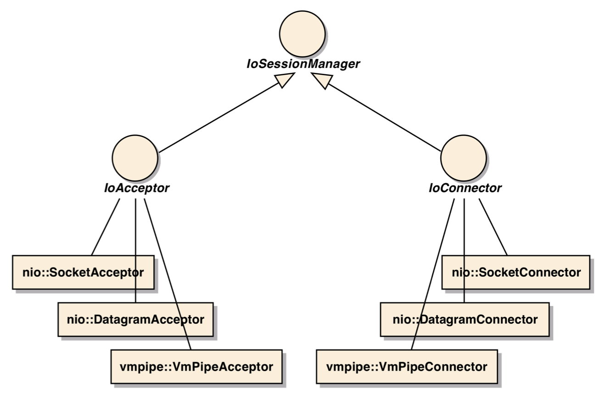
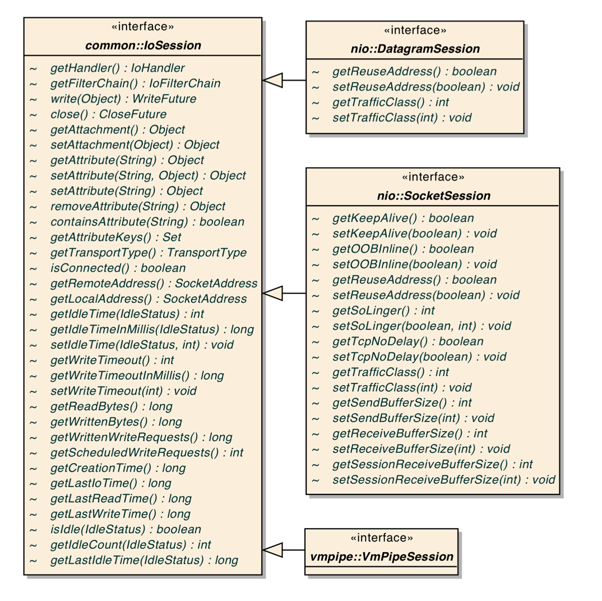

## IoService

```java
public interface IoService {
		// 服务绑定和配置
    IoServiceConfig getDefaultConfig();
    boolean isManaged(SocketAddress serviceAddress);
    Set<SocketAddress> getManagedServiceAddresses();
    
    // 获取session集合
    Set<IoSession> getManagedSessions(SocketAddress serviceAddress);
    
    // 添加和移除监听
    void addListener(IoServiceListener listener);
    void removeListener(IoServiceListener listener);

    // 过滤器相关
    IoFilterChainBuilder getFilterChainBuilder();
    void setFilterChainBuilder(IoFilterChainBuilder builder);
    DefaultIoFilterChainBuilder getFilterChain();
}
```


### IoAcceptor

```java
public interface IoAcceptor extends IoService {
    // 启动监听服务
    void bind(SocketAddress address, IoHandler handler) throws IOException;
    void bind(SocketAddress address, IoHandler handler, IoServiceConfig config) throws IOException;

    // 关闭监听服务
    void unbind(SocketAddress address);
    void unbindAll();

    // 创建session
    IoSession newSession(SocketAddress remoteAddress, SocketAddress localAddress);
}
```


#### SocketAcceptor

用于套接字传输（TCP/IP）

#### DatagramAcceptor

用于数据报传输（UDP/IP）

#### VmPipeAcceptor

将指定的{@link IoHandler}绑定到指定的{@link VmPipeAddress}


### IoConnector

```java
public interface IoConnector extends IoService {
    ConnectFuture connect(SocketAddress address, IoHandler handler);
    ConnectFuture connect(SocketAddress address, IoHandler handler, IoServiceConfig config);
    ConnectFuture connect(SocketAddress address, SocketAddress localAddress, IoHandler handler);
    ConnectFuture connect(SocketAddress address, SocketAddress localAddress, IoHandler handler, IoServiceConfig config);
}
```


## Mina的工作流程

1、客户端与服务端建立连接后会拿到一个IoSession对象；

2、客户端拿到会话后，通过IoSession#write(Object message)方法，向会话（即通道）写入消息，这里就是客户端向服务端发起请求的入口；

3、IoSession将消息包装成WriteRequest对象，然后转发给SocketFilterChain组件，然后SocketFilterChain通过#fireFilterWrite(IoSession session, WriteRequest writeRequest)方法，将请求委托给IoFilter进行处理；

4、在Mina中，第一个过滤器一定是HeadFilter，最后一个过滤器是TailFilter，这里filterWrite将会从过滤器链的最后一个开始执行，直到最后的HeadFilter过滤器，会将WriteRequest放到Session对应的writeRequestQueue队列中，后将session放到flushingSessions队列中，后续由IoProcessor处理器进行处理；

5、IoProcessor工作线程会一直轮询它管理的session，从队列中拿到session后，会从session的writeRequestQueue队列中获取WriteRequest，然后调用session中的IoFilterChain#fireMessageSent(IoSession session, WriteRequest request)方法处理消息，注意：session中处理请求的个数也会在这个时候进行统计的；

6、IoFilterChain会依次调用过滤器IoFilter#messageSent(NextFilter nextFilter, IoSession session, Object message)方法进行处理消息，注意：一般如果是异步的，则HeadFilter过滤器会将请求转发给ExecutorFilter过滤器进行异步处理；

7、当请求执行到TailFilter过滤器的时候，则会调用IoHandler#messageSent(IoSession session, Object message)方法进行处理；

8、当所有的过滤器都执行完，并且IoHandler也行执行完messageSent方法后，IoProcessor会将session放到flushingSessions队列中，


说明： IOService接口
用于描述我们客户端和服务端接口，其子类是connector和accptor，分别用于描述我们的客户端和服务端，
IOProceser多线程环境来处理我们的请求，
IOFilter提供数据的过滤工作：包括编解码，日志等信息过滤，
Handler就是我们的业务对象，自定义handler需要实现IOHandlerAcceptor。


内部流程详细说明： 


(1) IoService ：这个接口在一个线程上负责套接字的建立，拥有自己的 Selector ，监听是否有连接被建立。 

(2) IoProcessor ：这个接口在另一个线程上负责检查是否有数据在通道上读写，也就是说它也拥有自己的Selector ，这是与我们使用 JAVA NIO 编码时的一个不同之处，通常在 JAVA NIO 编码中，我们都是使用一个 Selector ，也就是不区分 IoService 与 IoProcessor 两个功能接口。另外，IoProcessor 也是 MINA 框架的核心组件之一 . 在 MINA 框架启动时，会用一个线程池来专门生成线程，来负责调用注册在 IoService 上的过滤器，并在过滤器链之后调用 IoHandler 。在默认情况 IoProcessor 会用N+1 个线程来轮流询问监视的端口是否有数据传送，其中 n 为 cpu 的内核个数。按一般的多线程设计概念来说，IoProcessor 的线程数是越多越好，但实际上并非如此，因为大家都知道， IO 的操作是非常占用资源的，所以项目中的 IoProcessor 的线程数应该根据实际需要来定，而这个数字可以在生成 IoAcceptor 对象时进行设定。 EgIoAcceptor acceptor = new NioSocketAcceptor( N ); 

(3.) IoFilter ：这个接口定义一组拦截器，这些拦截器可以包括日志输出、黑名单过滤，甚至是在过滤器链中利用 AOP 写上权限控制。数据的编码（ write 方向）与解码（ read 方向）等功能，其中数据的 encode 与 decode 是最为重要的、也是您在使用 Mina 时最主要关注的地方。 

(4.) IoHandler ：这个接口负责编写业务逻辑，也就是接收、发送数据的地方。如果大家把业务处理写好，并写好业务接口，真正要用时，只需要在此处替换即可，再次见证了 MINA 分层的彻底。 

其中 IoService 接口会专门起一个线程来轮询是否有新的连接产生，一旦有连接产生则通知 IoProcessor, 而IoProcessor 则起 n+1 个线程来检查连接是否有数据在上面读写。一旦有连接产生，并有数据读写，则通知 decode 或 encode ，进行报文的解码或编码，将处理后的报文再交给业务类进行业务处理。其中IoProcessor 是处理请求的分配，包括选择 Selector ，超时验证，状态记录等。总之这个类和 IoService 一起配合工作，封装了 NIO 底层的实现以及 MINA 框架内部的功能的支持 . 

结合实例，并根据以上的图文讲解，我们可以很轻易的总结出利用 MINA 编程的几个大致步骤： 

创建一个实现了 IoService 接口的类 

设置一个实现了 IoFilter 接口的过滤器（如果有需要的情况下） 

设置一个 IoHandler 接口实现的处理类，用于处理事件（必须） 

对 IoService 绑定一个端口开始工作 


注：这一点请特别注意，因 IoProcessor 也是相当于轮询机制，这导致在报文过长时，或其它原因导致报文不能一次传输完毕的情况下，必须保存同一连接 ( 在 MINA 中是以 IoSession 类生成的对象 ) 的上一次状态，这样才能截取到一个完成的报文，而这也是 decode( 编码器 ) 需要做的核心工作 。 







